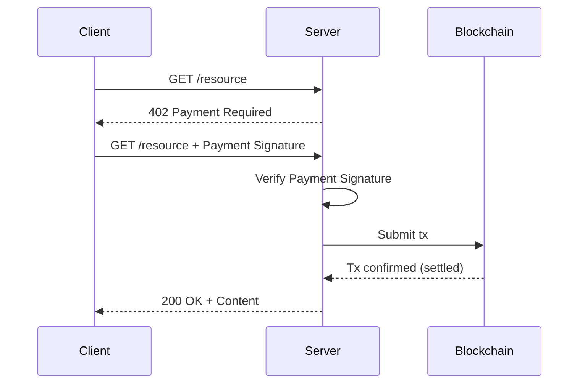

At this point, there's no debate that the majority of internet traffic in the future will be agentic.

Money makes the world go round, so agentic payments will be the foundation of making the web go round.

This post will likely be stale and oudated by the end of the year, but I wanted to cover what the state of agentic payment protocols is today.

The protocols I reference are aren't necesarily just for "agent payments", but they capture all the post-2023 trends in agentic communication.

The new OSI stack is already here. DNS, HTTP, TCP, TLS, aren't going anywhere, and neither are x402, A2A, UCP, MCP, ERC-8004.

## Overview

Table with columns:

- Protocol
- Industry Champions
- Current Volume
- Use cases
- Release date

A2A (Google), UCP (Google, Shopify), AP2, x402 (Cloudflare, Coinbase), MCP (Anthropic), ERC-8004 (Ethereum)

[x402](https://www.x402.org/)
[A2A](https://developers.googleblog.com/en/a2a-a-new-era-of-agent-interoperability/)
[UCP](https://shopify.engineering/ucp)
[MCP](https://modelcontextprotocol.io/docs/getting-started/intro)
[ERC-8004](https://eips.ethereum.org/EIPS/eip-8004)
? Stablecoins ?

## x402

Stats:

- 75M transactions and $24M of volume

Key Value Props:

- Internet-native payments
- Instant, low-cost transactions.
- No API keys, no subscriptions, no middlemen.
- AI-first, developer-friendly, and blockchain-agnostic

Champions:

- Cloudflare
- Coinbase



## A2A

Stats:

-

Key Value Props:

Champions:

- Google

- Add a quick diagram

## MCP

- Add a quick diagram

## ERC-8004

- Add a quick diagram

## Rough Notes

- **x402** – a machine-native payment rail using HTTP 402 for autonomous agent payments without API keys or subscriptions. It’s basically solving value transfer between agents and services.
- **A2A** (Google’s Agent-to-Agent) – a communication interoperability protocol enabling agents to exchange tasks, capabilities, and state securely across different vendors.
- **UCP** (Universal Commerce Protocol) – Shopify’s effort in standardizing commerce (payments, orders, fulfillment) likely in web & marketplace contexts (not AI-agent specific).
- **MCP** (Model Context Protocol) – Model Context Protocol, which defines context sharing and structured metadata flow for agent ecosystems.
- **ERC-8004** – a proposed trust and discovery layer for autonomous agents on chain, with identity, reputation, and validation registries.

1. **X402**
2. **A2A**
3. **MCP**
4. **8004**
5. **Under the Hood: Universal Commerce Protocol (UCP)**
6. **Look at the deck for more**
7. **Create tcp like diagrams that are very simple**
8. **Show a use case for each one**
9. **Is cryptography the foundation?**
10. **Easier to migrate to post quantum later when we need to**

11. **Under the Hood: Universal Commerce Protocol (UCP)**
12. **Look at the deck for more**

13. **Create tcp like diagrams that are very simple**
14. **Show a use case for each one**
15. **Is cryptography the foundation?**
16. **Easier to migrate to post quantum later when we need to**

```


agentic
```

- X402
- A2A
- MCP
- 8004
- Under the Hood: Universal Commerce Protocol (UCP)
- Look at the deck for more
- Create tcp like diagrams that are very simple
- Show a use case for each one
- Is cryptography the foundation?
- Easier to migrate to post quantum later when we need to
- Simple Payment Systems with Unlinkability
