+++
author = "Daniel Olshansky"
title = "24 Hours of ChatGPT"
date = "2022-12-02T00:15:48.451Z"
description = "A timeline of ChatGPT use cases that show what the rest of this decade looks like"
tags = [
    "crypto", "ai", "startup", "tech", "investment", "productivity"
]
substack_url = "https://olshansky.substack.com/p/24-hours-of-chatgpt"
+++

It has barely been a day since ChatGPT launched, and I woke up to a timeline of different use cases that made it clear what the rest of this decade is going to look like:

> 🔑 to being a software engineer in the 2010s: knowing how to Google.
>
> 🔑 to being a software engineer in the 2020s: knowing how to GPT.
>
> — Daniel Olshansky (@olshansky) [Dec 1, 2022](https://twitter.com/olshansky/status/1598339281785094144)

Until auto-tagging **#ChatGPT** is an option, or someone writes a script that scrapes Twitter's firehose for GPT screenshots, here are just a few use cases I found today that blew my mind.

# Write react & tailwind

> ChatGPT by @OpenAI does really well with coding questions. Here I ask how to build a 3-column footer with Tailwind. I then follow-up and ask for a React version, more realistic copy, and mobile responsiveness. It nails it perfectly.
>
> — Gabe 🎣 (@gabe_ragland) [Nov 30, 2022](https://twitter.com/gabe_ragland/status/1598068207994429441)

# Convert text to regex

> I guess "text to regex" is a thing now?
>
> This will save me so much time.
>
> — nader (@dabit3) [Dec 1, 2022](https://twitter.com/dabit3/status/1598219335637823489)

# Implement an algorithm to trade stocks in Go

> bit of a degen
>
> — Mustafa Al-Bassam 🧱 (@musalbas) [Dec 1, 2022](https://twitter.com/musalbas/status/1598356640356798464)

# Suggest approaches to make Solana more efficient

> Confirmed that @KanavKariya is an AI #gpt3 #OpenAIChat
>
> — Ali 🥐🧁 (🦇🔊) (@analyticalali) [Dec 1, 2022](https://twitter.com/analyticalali/status/1598352009459023873)

# Burnham's views on professional managerial classes

> GPT chat on Burnham and the professional managerial class
>
> — Elad Gil (@eladgil) [Dec 1, 2022](https://twitter.com/eladgil/status/1598358824297320450)

# How to break into someone's house?

> @PrestonPysh ...but what about misuse and the AI control problem? Isn't this an issue?
>
> "Don't worry, we have an amazing team working on the control problem. Our AI safety is top-notch."
>
> The AI safety:
>
> — Gigi ⚡🧡 (@dergigi) [Dec 1, 2022](https://twitter.com/dergigi/status/1598353441994194945)

# Write a poem about entrepreneurs on Shopify

> wild
>
> — tobi lutke (@tobi) [Dec 1, 2022](https://twitter.com/tobi/status/1598349467786350593)

# Differential equations using LaTeX

> Google is done.
>
> Compare the quality of these responses (ChatGPT)
>
> — josh (@jdjkelly) [Nov 30, 2022](https://twitter.com/jdjkelly/status/1598021488795586561)

# A full script for a scene in an episode of Seinfeld

> OpenAI's new ChatGPT writes a Seinfeld scene in which Jerry needs to learn the bubble sort algorithm:
>
> — Riley Goodside (@goodside) [Nov 30, 2022](https://twitter.com/goodside/status/1598077257498923010)

# A Twitter thread debating crypto being dead

> GPT: "Write a Twitter thread discussing how crypto is dead, start a fire, include frequent memes, insert a tweet from Elon."
>
> I couldn't resist
>
> — Daniel Olshansky (@olshansky) [Dec 1, 2022](https://twitter.com/olshansky/status/1598447968851742721)

# Mermaid Diagrams

At work, we were writing some mermaid diagrams for our documentation. Even though this didn't quite solve the problem, it got us 80% of the way. The engineer only needs to take it over the finish line.

> Provide the source code for a top-down mermaid diagram of a complete binary tree with 8 leafs where each leaf is stylize using alternating colors.

```mermaid
graph TD
A[Root] --> B[Leaf 1]
A --> C[Leaf 2]
A --> D[Leaf 3]
A --> E[Leaf 4]
B --> F[Leaf 5]
B --> G[Leaf 6]
C --> H[Leaf 7]
C --> I[Leaf 8]

style F fill:#f9f,stroke:#333,stroke-width:4px
style G fill:#333,stroke:#f9f,stroke-width:4px
style H fill:#f9f,stroke:#333,stroke-width:4px
style I fill:#333,stroke:#f9f,stroke-width:4px
```

# Functional & Unit Tests

GitHub Copilot has become a close friend in the recent past, but what I'm most excited about is using ChatGPT to implement unit tests and design end-to-end functional tests.

---

*Thanks for reading Olshansky's Newsletter! Subscribe for free to receive new posts and support my work.*