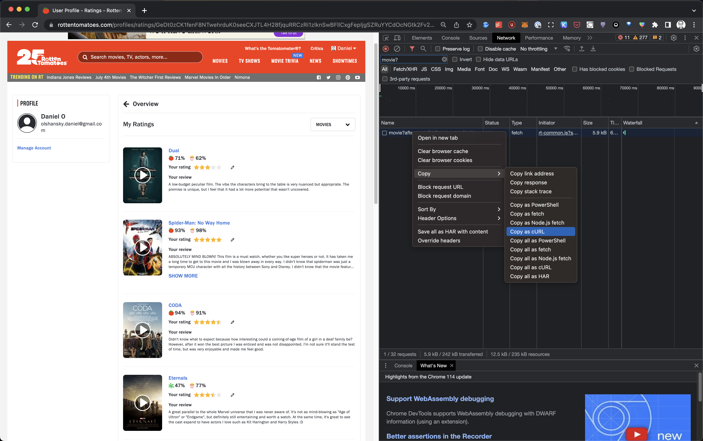
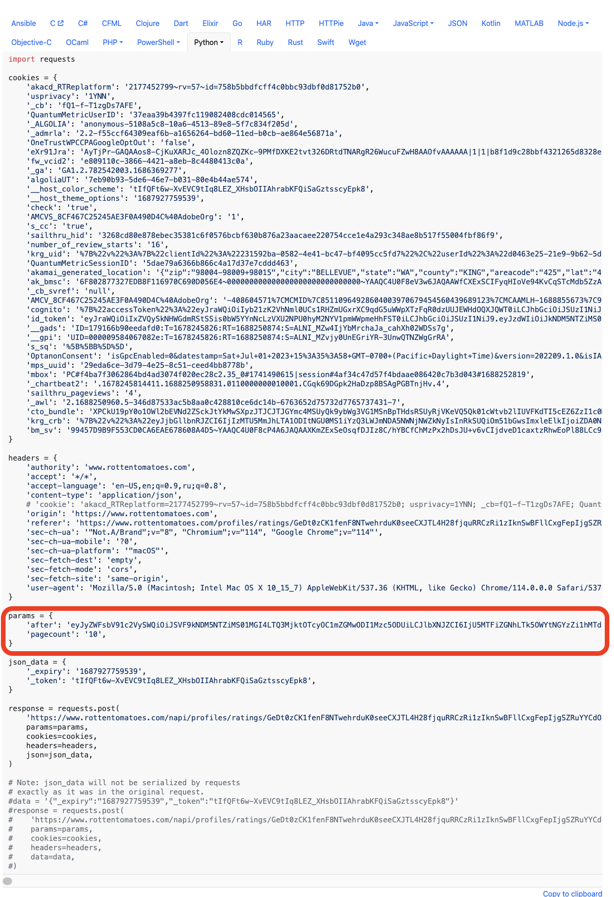

# Rotten Tomatoes to Hugo

Take control of your rotten tomatoes reviews and publish them to your hugo site.

## Retrieving your reviews

1. Go to your movie reviews ([here's](https://www.rottentomatoes.com/profiles/ratings/GeDt0zCK1fenF8NTwehrduK0seeCXJTL4H28fjquRRCzRi1zIknSwBFllCxgFepIjgSZRuYYCdOcNGtk2Fv2HmWu9zSxLTZQfJjIB1FVKuYj/movie) mine for reference)
2. Open chrome dev tools
3. Search for `movie?` in the network tab
4. Right click and copy as curl
5. Paste the command in [curlconverter.com](https://curlconverter.com) and select `Python`
6. In the `params` dictionary, do the following:
   1. Comment out `after`
   2. Increase `pagecount` to something really large to capture all your reviews in one request
7. Run the command and save the output to a file:
8. Copy the code to a local file called `rt.py`, add `print(json.dumps(response.json()))` at the end of the file and run it:

   ```bash
   python3 rt.py >> movie.json
   ```

9. Repeat the above for `tv` instead of `movie`.
10. You can look at my `hugo.py` file which takes this json outputs and formats it for use on this website, but otherwise you are free to do w/e you want. The only limit is your imagination!


_Copy as curl from the network tab_


_Python command from curlconverter.com showing the parameters that need to be modified_
